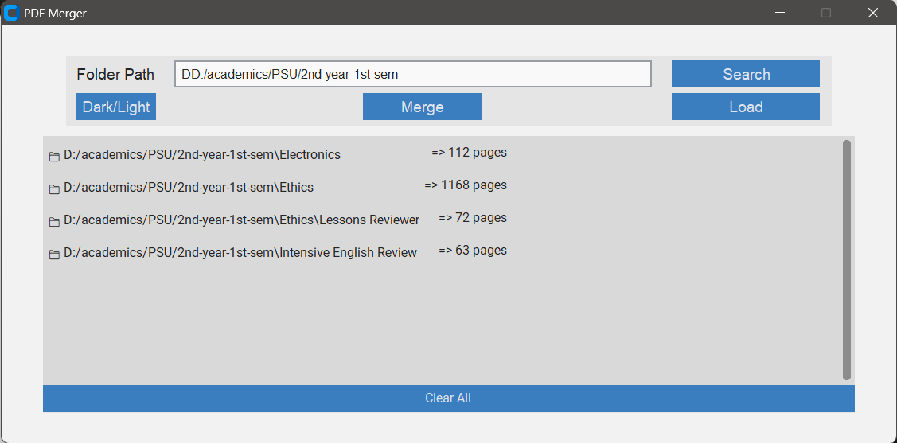
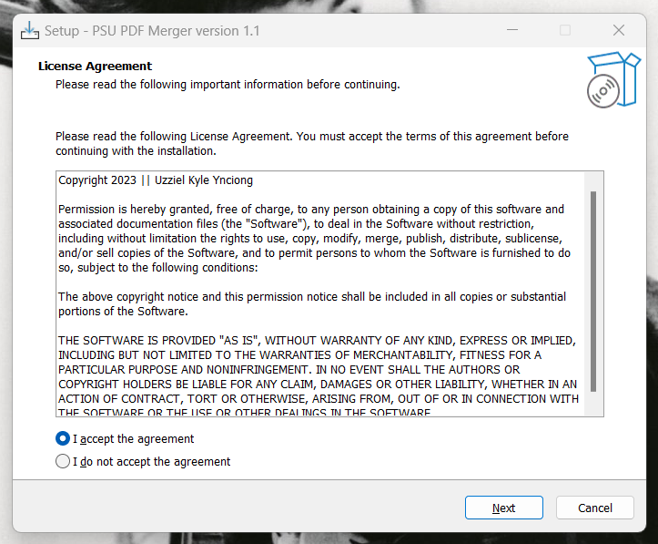
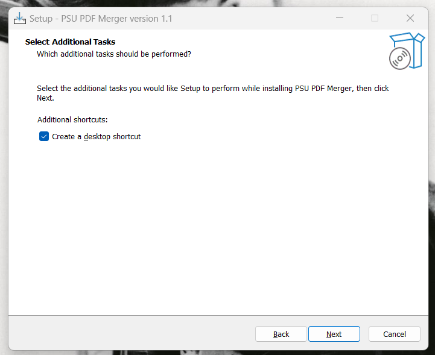
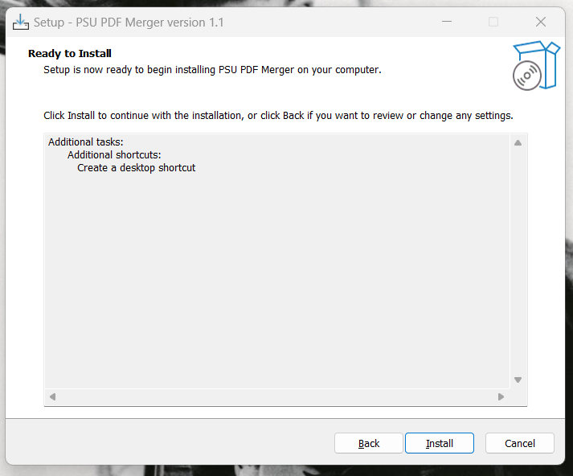
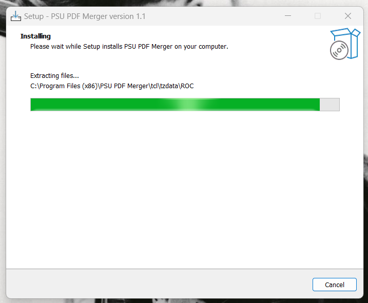
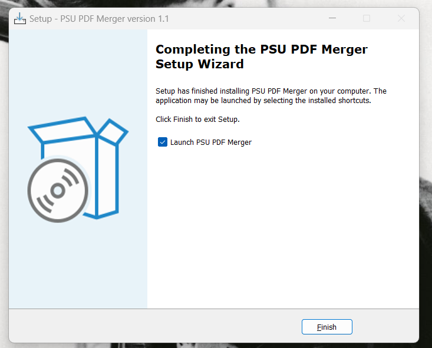
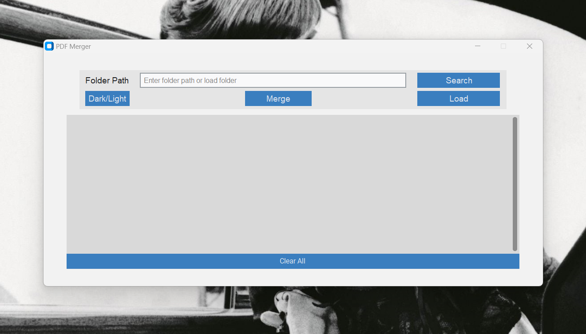
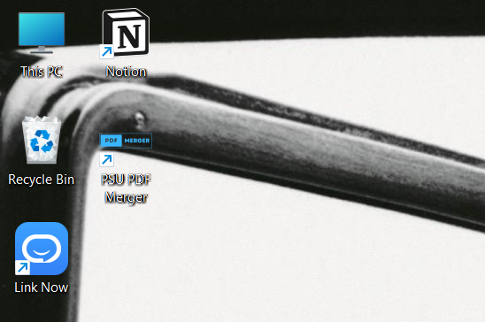

# PDF Merger GUI

A PDF Merger app for PSU faculties

## Installation

1. Download the installer - psu-pdf-merger1.1.exe
1. Run the installer
1. Read and accept the agreement, then click '**Next**'

1. Create a desktop shortcut, then click '**Next**'

1. Click '**Install**'

1. The setup will install the app

1. After installation, click '**Finish**'

1. The app will launch just after exiting the setup

1. A shortcut is also created in your desktop

## Usage

1. Enter folder path and click 'Search', or 'Load' a folder
1. Click 'Merge' to start merging PDF files
1. After merging, the window will display all the folders that has its PDF files merged and its total pages
1. Check the outputs in each folder in the File Explorer
